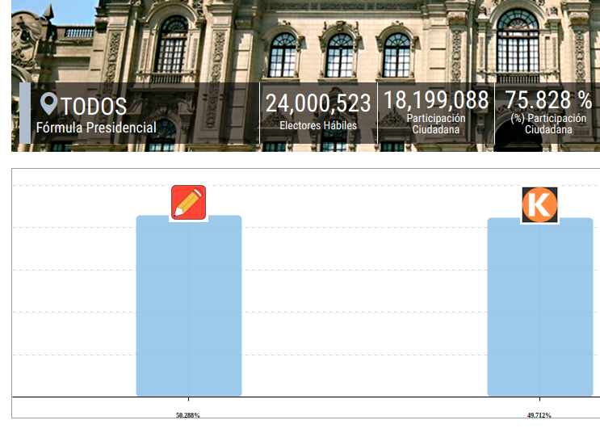
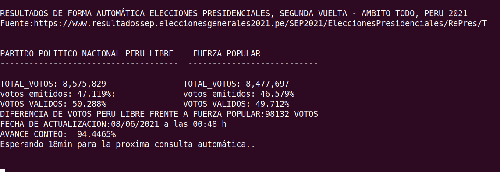

# PRESENTACIÓN AUTOMÁTICA DE RESULTADOS SEGUNDA ELECCIÓN PRESIDENCIAL, AMBITO TODO - PERU 2021

Con este script ya no tendrá que estar visitando a la página de onpe cada 30min xD. simplemente déjelo ejecutando una sola vez y el servicio le mostrará los avances de forma automática cada 15min aprox.


### Requisitos:
- git
- pip3 
- virtualenv 
- python3.6.x 
- requests

### Requisitos S.O:
- Windows, linux o mac.

### Ejecución en modo usuario
En windows ejecutar el archivo :

abrir el ejecutable `resultados_segunda_vuelta_onpe.exe`

En linux y mac ejecutar el archivo en terminal:

ejecutar el archivo  `./resultados_segunda_vuelta_onpe`




### Ejecución en modo desarrollador:

Crear un entorno virtual(opcional)
```
virtualenv -p python3 env_resultados_onpe && source env_resultados_onpe/bin/activate
```
Clonar el proyecto:
```
git@github.com:yachaycode/api-resultados-onpe-2021.git
```
Instalación de dependencias
```
pip install -r install requeriments.txt
```
ejecutar el script

```
python resultados_segunda_vuelta_onpe.py
```

### Fuente:
[https://www.onpe.gob.pe/](https://www.resultadossep.eleccionesgenerales2021.pe/SEP2021/EleccionesPresidenciales/RePres/T)

### Contactos
Si tienes alguna duda me puedes escribir a wsp [+51983679449](https://wa.me/51983679449).