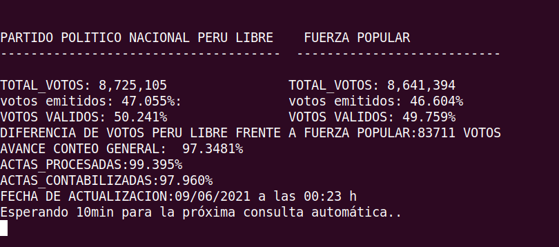

# PRESENTACIÓN DATOS ABIERTOS DE ONPE, RESULTADOS SEGUNDA ELECCIÓN PRESIDENCIAL- PERU 2021

Este proyecto trata de proveer recursos, herramientas y técnicas para poder tener toda la información organizado y estructurado para su posterior análisis y presentación a la ciudadanía en general, del proceso de elecciones presidenciales segunda vuelta 2021. Un especie de datos abiertos para científicos de datos, analistas de datos, colectivos sociales, periodistas, investigadores, políticos, etc.
 

## COMPONENTES DEL PROYECTO:
- Prensentación autómatica de datos generales avance de conteo de votos a nivel nacional.

- Recolección y almacenado de información en base de datos orientado a documentos, de todas las actas por ubigeo hasta 11 de junio del 2021.


#### Nota:
- Por restricciones de Onpe, ahora solo fuciona con un navegador en primer plano, es decir, solicitudes sin cabeza están bloqueados..
- El archivo ejecutable para windows ya está actualizado, cuando ejecutan va abrir automáticamente el nevegador chrome, no cerrar.


### Requisitos:
- git
- pip3 
- virtualenv 
- python3.6.x 
- requests
- selenium
- Mongodb 4.4

### Requisitos S.O:
- Windows, linux o mac.

### Ejecución en modo usuario, visualización automática de resumen de resultados
En windows ejecutar el archivo :

abrir el ejecutable `resultados_segunda_vuelta_onpe.exe`

En linux y mac ejecutar el archivo en terminal:

ejecutar el archivo  `./resultados_segunda_vuelta_onpe`




### Ejecución en modo desarrollador del proyecto en general:

Crear un entorno virtual(opcional)
```
virtualenv -p python3 env_resultados_onpe && source env_resultados_onpe/bin/activate
```
Clonar el proyecto:
```
git@github.com:yachaycode/api-resultados-onpe-2021.git
```
Instalación de dependencias
```
pip install -r install requeriments.txt
```
crear el archivo de configuracion y agregar sus credenciales de DB mongodb
```
cp example_config.json config.json
```

ejecutar el script, visualización de resumen resultados

```
python resultados_segunda_vuelta_onpe.py
```

ejecutar el script, extracción actas de cada mesa de votación

```
python extraccion_actas_mesas_onpe.py
```

## Cargar datos en mongodb
- Debes tener instalado mongo y configurado, más información de [instalación de MongoDB](https://docs.mongodb.com/manual/installation/) .

Puede restaurar datos a mongo, pasos:

1: Create una base de datos llamado  `db_onpe_presidenciales`

2: Descomprime el archivo `db_onpe_presidenciales.zip`  

3: Ejecutar este comando para restaurar la DB, debes sustituir el parámetros `userxxxx` y `passwordxxxx` por tu configuración de mongo.

```
mongodump --host 127.0.0.1 --port 27017 --username userxxxx --password passwordxxxx --authenticationDatabase admin --db db_onpe_presidenciales

```


### Fuente:
[https://www.onpe.gob.pe/](https://www.resultadossep.eleccionesgenerales2021.pe/SEP2021/EleccionesPresidenciales/RePres/T)


Referencias:

[Ubigeos Perú](https://account.geodir.co/recursos/ubigeo-reniec-peru.html)

[RoTorresT extracción de actas en .json, se encuentra en el archivo: data-acts.zip](https://github.com/RoTorresT/segunda_vuelta_peru_2021)


## Colaboradores

[Datascience Perú](https://www.datascience.pe/)

[Hackactivistas](https://hackactivistas.org/)


### Contactos
Si tienes alguna duda me puedes escribir a wsp [+51983679449](https://wa.me/51983679449).
